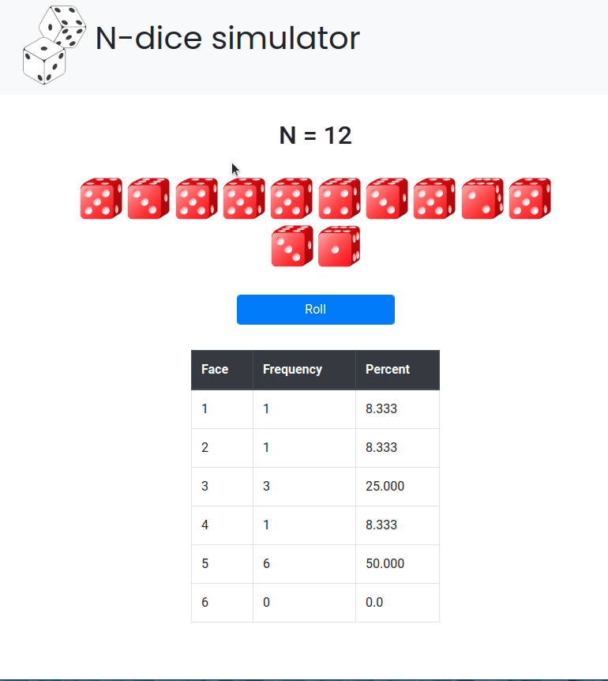

# n-dice-simulator

Projeto-base para o simulador de `n` dados. Você deve completar a parte em TypeScript, conforme orientado no enunciado do Moodle.

O GIF abaixo demonstra como o sistema deve se comportar, com diferentes valores de `n`.

